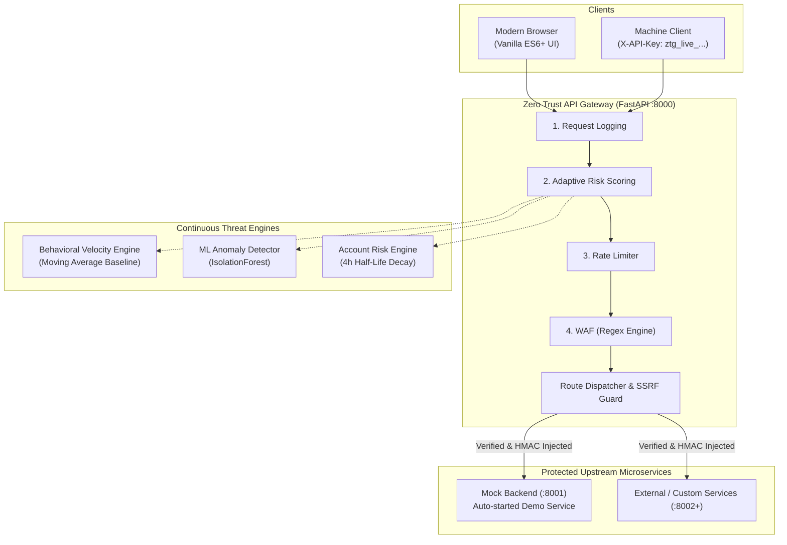

# 🎬 Zero Trust API Gateway — Master Demo & Presentation Guide

> **Author:** Arshadali Athani — RV Institute of Technology and Management  
> **Repository:** Zero Trust Secure API Gateway  
> **Core Architecture:** FastAPI · Python 3.11+ · SQLAlchemy 2 · SQLite/PostgreSQL · scikit-learn · Uvicorn · Docker  
> **Document Purpose:** The single comprehensive demo guide for college project reviews, technical interviews, live defense presentations, and end-user walkthroughs.

---

## 📑 Table of Contents

1. [30-Second Elevator Pitch & Key Differentiators](#1-30-second-elevator-pitch--key-differentiators)
2. [Architecture & Request Pipeline Reference](#2-architecture--request-pipeline-reference)
3. [Pre-Flight Checklist & Rapid Setup (< 2 Minutes)](#3-pre-flight-checklist--rapid-setup--2-minutes)
4. [The 10-Minute Live Presentation Walkthrough](#4-the-10-minute-live-presentation-walkthrough)
   - [Scene 1: Zero Trust Authentication & Token Versioning](#scene-1-zero-trust-authentication--token-versioning)
   - [Scene 2: RFC 6238 TOTP Multi-Factor Authentication (MFA)](#scene-2-rfc-6238-totp-multi-factor-authentication-mfa)
   - [Scene 3: Cryptographic Scoped API Keys & Brute-Force Guard](#scene-3-cryptographic-scoped-api-keys--brute-force-guard)
   - [Scene 4: Zero Trust Reverse Proxy & SSRF Protection](#scene-4-zero-trust-reverse-proxy--ssrf-protection)
   - [Scene 5: THE SHOWSTOPPER — Live Attack Lab & Adaptive Risk Engine](#scene-5-the-showstopper--live-attack-lab--adaptive-risk-engine)
   - [Scene 6: Admin Security Console & Instant Recovery](#scene-6-admin-security-console--instant-recovery)
5. [CLI Attack Simulation Demo (`scripts/simulate_attack.py`)](#5-cli-attack-simulation-demo-scriptssimulate_attackpy)
6. [Viva Voce & Technical Interview Defense (Top 15 Questions)](#6-viva-voce--technical-interview-defense-top-15-questions)
7. [Demo Troubleshooting & Emergency Fixes](#7-demo-troubleshooting--emergency-fixes)

---

## 1. 30-Second Elevator Pitch & Key Differentiators

### The Pitch
> *"Traditional web application security relies on a 'castle-and-moat' perimeter model: once traffic enters the internal network, it is implicitly trusted. Our **Zero Trust API Gateway** operates on the core principle: **'Never Trust, Always Verify'**.
> 
> Acting as an intelligent reverse proxy, every incoming request—internal or external—is evaluated in real time across **identity**, **content payloads**, **behavioral velocity**, and **unsupervised machine learning anomaly scoring**. Threats are neutralized at the edge before backend microservices are ever touched, featuring self-healing 4-hour risk decay, real-time WebSocket attack visualization, and stateless token-version session revocation."*

### Why This Project Stands Apart from Typical Academic Projects
| Standard Student / CRUD Project | Our Zero Trust Secure API Gateway |
|---|---|
| Basic username/password login with MD5/SHA-256 | **Argon2** password hashing (memory-hard, no 72-byte truncation) + RFC 6238 TOTP MFA |
| Static rate limiters (e.g. 100 req/min for all) | **Dynamic, adaptive risk scoring** with 3-tier response (Monitor → Step-up MFA → Freeze) |
| Hardcoded rules only | **IsolationForest ML Anomaly Detector** (unsupervised scikit-learn) with graceful fallback |
| Attacks shown via slides or diagrams | **Interactive Live Attack Lab** firing real attacks against the actual middleware stack over WebSocket |
| JWT expiration only (cannot revoke stolen tokens) | **Stateless `token_version` revocation**: mass session invalidation with zero Redis dependency |
| Blind proxying vulnerable to internal pivoting | **SSRF DNS filtering** blocking AWS/GCP metadata (`169.254.169.254`), loopbacks, and private CIDRs |
| Static permanent IP bans | **Self-healing 4-hour exponential risk decay** and granular `(user_id, IP)`-scoped freezes |

---

## 2. Architecture & Request Pipeline Reference

### The Middleware Ordering Principle
The gateway implements a high-performance ASGI middleware pipeline where order is deliberate and security-critical:

```
[Incoming Request]
       │
       ▼
 1. Request Logging (outermost: logs ALL requests, even 403/429 rejections & timing)
       │
       ▼
 2. Adaptive Risk Scoring (computes per-request threat score; MUST run before rate limiter so flood volume is scored!)
       │
       ▼
 3. Sliding-Window Rate Limiting (in-memory sliding window; exempts static UI & health checks)
       │
       ▼
 4. Web Application Firewall (WAF) (deep regex scanning of URL, query params, headers, and decoded JSON body)
       │
       ▼
 5. CORS Middleware (strict origin control & allowed headers)
       │
       ▼
 6. Session Middleware (OAuth2 state validation & CSRF prevention)
       │
       ▼
 7. Route Handlers & Reverse Proxy (SSRF validation, identity injection, upstream dispatch)
```



---

## 3. Pre-Flight Checklist & Rapid Setup (< 2 Minutes)

### Option A: Native Execution (Recommended for Fast Local Demos)

1. **Activate Environment & Validate Dependencies:**
   ```powershell
   # Windows PowerShell
   .\.venv\Scripts\activate
   ```
2. **Start the API Gateway:**
   ```powershell
   python run.py
   ```
   *The gateway boots on port **8000**, automatically initializes the SQLite schema, and launches the internal mock upstream backend on port **8001** (`/api/v1/data`).*
3. **Optional Standalone Demo Service (Port 8002):**
   ```powershell
   # In a separate terminal (optional, for custom proxy demo)
   python demo_service.py
   ```
4. **Bootstrap an Admin User:**
   ```powershell
   python scripts/make_admin.py admin@example.com
   ```
   *(If you haven't registered `admin@example.com` yet, register via the UI first, then run this command to grant `admin` privileges).*

### Option B: Docker Compose (Zero Configuration)
```bash
docker compose up --build
```
- Gateway runs on `http://127.0.0.1:8000`
- SQLite database is persisted under `./data`
- Mock microservice is embedded internally

---

## 4. The 10-Minute Live Presentation Walkthrough

Follow these 6 sequential scenes for an engaging demonstration during a project defense:

---

### Scene 1: Zero Trust Authentication & Token Versioning
*Goal: Prove how the gateway eliminates perimeter trust and enables instant mass session revocation.*

1. **Navigate to:** `http://127.0.0.1:8000/frontend/register.html`
2. **Action:** Register a new user:
   - Email: `demo_user@example.com`
   - Username: `demouser`
   - Password: `Password@12345`
3. **Explain to the Evaluators:**
   - *"The password is never hashed with obsolete bcrypt (which truncates at 72 bytes) or SHA-256. We use **Argon2**, the winner of the Password Hashing Competition, which is memory-hard and GPU-resistant."*
4. **Login:** Redirects to `login.html`. Log in with the credentials.
5. **Inspect the Token (F12 → Console / Application → Local Storage):**
   - Copy the `token` value and open [jwt.io](https://jwt.io).
   - Point out the payload claims:
     ```json
     {
       "sub": "demo_user@example.com",
       "user_id": 1,
       "role": "user",
       "ver": 1,
       "mfa_verified": false,
       "exp": 1743456789
     }
     ```
6. **The Token Versioning Demonstration (`ver: 1`):**
   - *"How do you invalidate a JWT before its expiration date without maintaining a heavy Redis blacklist?"*
   - Explain: When a user changes their password or an administrator flags an account, the backend executes `UPDATE users SET token_version = token_version + 1`.
   - Every incoming request verifies that `token['ver'] == user.token_version`. If a breach occurs, bumping this integer instantly and statelessly revokes **every active session globally**.

---

### Scene 2: RFC 6238 TOTP Multi-Factor Authentication (MFA)
*Goal: Show how Zero Trust enforces strong identity verification at rest and under elevated risk.*

1. **Navigate to Profile:** Open `http://127.0.0.1:8000/frontend/profile.html`.
2. **Enable MFA:** Click **Enable Two-Factor Authentication**.
   - A cryptographic RFC 6238 secret is generated and rendered as a QR Code.
   - Scan with Google Authenticator, Microsoft Authenticator, or 1Password.
   - Enter the 6-digit TOTP code and click **Verify & Activate**.
3. **Test the Enforcement:**
   - Log out, then attempt to log back in with Email and Password.
4. **What Happens:**
   - The login page intercepts the authentication. Instead of granting dashboard access, a smooth 2FA TOTP prompt modal appears.
   - The server first issues a restricted, unverified token (`mfa_verified: false`).
   - Any attempt to access protected APIs (`/api/v1/*`, `/admin/*`) returns `403 Forbidden: {"detail": "MFA required"}`.
   - Enter the valid 6-digit code. The server issues a fully verified JWT stamped with `mfa_verified: true` and an `mfa_at` timestamp.

---

### Scene 3: Cryptographic Scoped API Keys & Brute-Force Guard
*Goal: Demonstrate least-privilege machine-to-machine authentication.*

1. **Navigate to:** `http://127.0.0.1:8000/frontend/api-keys.html`.
2. **Create an API Key:**
   - Name: `Analytics Worker`
   - Scope: `proxy:data` (least-privilege scope)
   - Expiration: 30 days
3. **The One-Time Secret Reveal:**
   - A modal appears showing `ztg_live_8f9c2e...`.
   - Explain: *"This key is shown exactly once. The database never stores plaintext API keys—only a **SHA-256 cryptographic digest** (`hash_api_key`) and a short display prefix (`ztg_live_8f...`). If the database is compromised, attacker cannot use the hashes."*
4. **Brute-Force Guard Demo:**
   - Send 5 invalid API keys rapidly via terminal or PowerShell:
     ```powershell
     1..5 | ForEach-Object {
       curl.exe -s -o /dev/null -w "%{http_code}`n" -H "X-API-Key: ztg_live_invalid_key_$_" http://127.0.0.1:8000/api/v1/data/hello
     }
     ```
   - On the 5th attempt within 60 seconds, the IP address is banned from key authentication for 300 seconds (5 minutes) and a `SecurityEvent` is dispatched to the audit log.

---

### Scene 4: Zero Trust Reverse Proxy & SSRF Protection
*Goal: Show how the Gateway acts as a secure, hardened bastion protecting internal services.*

1. **The Architecture of the Upstream:**
   - Microservices register with the gateway via name and upstream URL.
   - The demo service `data` routes to `http://127.0.0.1:8001`.
2. **Execute an Authorized Proxy Request:**
   - In browser DevTools Console (or terminal):
     ```javascript
     fetch('/api/v1/data/hello', {
       headers: { 'Authorization': 'Bearer ' + localStorage.getItem('token') }
     }).then(r => r.json()).then(console.log);
     ```
   - Response: `{"message": "Hello from the backend microservice!", "user": "demo_user@example.com"}`.
3. **Show Header Stripping & Identity Injection:**
   - Explain what happened behind the scenes:
     - Hop-by-hop headers (`Connection`, `Keep-Alive`, `Proxy-Authenticate`) were stripped.
     - Untrusted incoming `X-Forwarded-For` headers were discarded unless coming from trusted CIDRs.
     - The Gateway securely injected:
       - `X-Gateway-User`: `demo_user@example.com`
       - `X-Request-ID`: Unique UUID4 trace identifier
       - `X-Gateway-HMAC`: Cryptographic HMAC-SHA256 signature ensuring backends only accept requests originating from this gateway.
4. **SSRF Guard Demonstration:**
   - Try registering or proxying to cloud metadata (`http://169.254.169.254/latest/meta-data/`).
   - The gateway's `validate_upstream_url` actively resolves the hostname via DNS, parses the IP, and **rejects AWS/GCP/Azure link-local metadata addresses with a 403 SSRF Blocked**.

---

### Scene 5: THE SHOWSTOPPER — Live Attack Lab & Adaptive Risk Engine
*Goal: Execute real cyber attacks against the gateway and watch defense mechanisms trigger in real time.*

1. **Navigate to:** `http://127.0.0.1:8000/frontend/attack-lab.html` (Must be logged in as an Admin).
2. **Explain the Setup:**
   - *"Most security projects show mock graphs. The Attack Lab executes **real HTTP traffic** against our actual FastAPI middleware stack. Live metrics and threat events stream back via **WebSocket** (`/ws/attack-lab`)."*

#### Attack Scenario A: Web Application Firewall (WAF) SQL Injection
1. Click **SQL Injection** attack card → Click **Launch Attack**.
2. **What Happens Live:**
   - The attack simulator fires real HTTP requests containing SQL injection vectors:
     `' OR '1'='1`, `UNION SELECT username, password FROM users`, `DROP TABLE users;--`.
   - Requests are immediately blocked with **HTTP 403 Forbidden** and header `X-WAF-Blocked: sqli`.
   - The live counter increments `Blocked Requests: +10`, and the threat timeline streams:
     `[WAF Block] SQL Injection pattern intercepted in body/query`.
   - **Key Architectural Fact:** The request was terminated in middleware *before* reaching any database query or route handler.

#### Attack Scenario B: Cross-Site Scripting (XSS) & Path Traversal
1. Select **Cross-Site Scripting (XSS)** or **Path Traversal** → Click **Launch Attack**.
2. Payloads containing `<script>alert(1)</script>`, `javascript:void(0)`, and `../../../../etc/passwd` are intercepted and blocked with 100% precision.

#### Attack Scenario C: Request Flood & 3-Tier Adaptive Risk Escalation
*This is the core conceptual achievement of the project.*

1. Select **Request Flood** attack card.
2. Configure: **Intensity: 10 RPS**, **Duration: 15 Seconds** → Click **Launch Attack**.
3. **Watch the Live Escalation:**
   - **Tier 1 (Normal to Low/Medium Risk, 0.0 → 0.40):**
     Requests pass with `X-Risk-Action: allow`.
   - **Tier 2 (High Risk Spike, 0.55+):**
     The behavioral engine notices the rate exceeds `max(30, baseline * 3)`. The account risk climbs. The gateway triggers **Step-Up MFA**: any call to sensitive endpoints (`/api/v1/*`, `/admin/*`) receives `403 Step-up required` and `X-Risk-Stepup: 1`. The user must confirm their TOTP to continue.
   - **Tier 3 (Critical Threat Level, 0.85+):**
     Risk reaches critical threshold. The gateway executes **Account Freeze**:
     1. Automatic session revocation (`token_version += 1` logs out all active devices).
     2. Account is locked for the attacker's IP for 1 hour (`AccountFreeze` table).
     3. Subsequent requests receive `403 Account Frozen`.

#### Attack Scenario D: Self-Healing 4-Hour Half-Life Decay
- Explain the mathematical recovery mechanism:
  $$\text{Current Risk} = \text{Peak Risk} \times 0.5^{\frac{\Delta t}{4\text{ hours}}}$$
- Unlike static firewalls that blacklist users forever, legitimate users who triggered false positives naturally decay back to clean standing over time without administrative intervention.

---

### Scene 6: Admin Security Console & Instant Recovery
*Goal: Show observability, SIEM-ready audit trails, and administrative overrides.*

1. **Navigate to:** `http://127.0.0.1:8000/frontend/admin.html`.
2. **Review Real-Time SOC Metrics:**
   - Total System Requests, Threats Intercepted, Active Freezes, High-Risk Users.
3. **Audit Log Table:**
   - Every single event (`waf_blocked`, `rate_limited`, `high_risk_request`, `proxied`) is displayed with exact Client IP, Country, Timestamp, Latency, and Status Code.
4. **Live Administrative Unfreeze:**
   - Locate the test account in the **User Management** table displaying the `FROZEN` badge.
   - Click the **Unfreeze** button (`POST /admin/users/{id}/unfreeze`).
   - The `AccountFreeze` record is purged, risk is restored to `0.0`, and the account is instantly restored to active status.

---

## 5. CLI Attack Simulation Demo (`scripts/simulate_attack.py`)

If presenting to a CLI-focused audience or running automated checks:

```powershell
# In terminal 1:
python run.py

# In terminal 2:
python scripts/simulate_attack.py
```

### What `simulate_attack.py` Does:
1. **Phase 1 — Velocity & Pattern Risk Escalation:**
   Fires 130 sequential requests using a known vulnerability scanner User-Agent (`sqlmap/1.5.8`) and an invalid token.
   - Watch the output stream:
     ```
     [Req 001] Status: 401 | Risk: 0.45 | Action: monitor
     [Req 045] Status: 401 | Risk: 0.65 | Action: challenge
     [Req 090] Status: 401 | Risk: 0.78 | Action: challenge
     [Req 125] Status: 403 | Risk: 0.88 | Action: block (IP Temporarily Banned)
     ```
2. **Phase 2 — Immediate WAF Payloads:**
   Sends SQL injection payloads across headers, query parameters, and JSON request bodies:
   - Each payload outputs: `[WAF TEST] Status: 403 | X-WAF-Blocked: sqli | SUCCESS`

---

## 6. Viva Voce & Technical Interview Defense (Top 15 Questions)

### Q1: Why Zero Trust instead of traditional perimeter security?
> **Answer:** Perimeter security assumes that any entity inside the corporate firewall or private network can be trusted. Once an attacker breaches the perimeter (via VPN compromise, phishing, or insider threat), they can pivot laterally with zero resistance. Zero Trust assumes the network is already hostile. Every single request must be authenticated, authorized, inspected for threats, and behaviorally scored regardless of whether it originates from the public internet or an internal microservice.

### Q2: Why does Risk Scoring run before Rate Limiting in middleware order?
> **Answer:** If Rate Limiting ran first, flood traffic would be rejected with HTTP 429 before the Adaptive Risk Engine could analyze it. The risk engine would never observe the abnormal velocity, behavioral anomalies would never be recorded, and the account risk score would never reach the critical freeze threshold. By placing Risk Scoring before Rate Limiting, the gateway accurately computes threat levels while still maintaining volumetric protection.

### Q3: How does Token Versioning revoke JWTs without Redis or a centralized database blacklist?
> **Answer:** Standard JWTs are stateless and cannot be revoked until their `exp` timestamp passes. Our gateway embeds an integer claim `ver` in every token, matching the `token_version` column in the user's database record. When an account password is changed or a freeze is triggered, we simply increment `token_version += 1`. Every request verifies `token["ver"] == user.token_version`. A single integer comparison invalidates all existing JWTs without the memory overhead of a Redis revocation blacklist.

### Q4: Why did you choose Argon2 over bcrypt or PBKDF2?
> **Answer:** Bcrypt suffers from a known architectural limitation: it silently truncates passwords longer than 72 bytes. Furthermore, bcrypt is vulnerable to specialized FPGA and GPU cracking rigs because it is CPU-bound rather than memory-hard. Argon2 was the winner of the Password Hashing Competition (PHC); it requires configurable memory buffers to compute, making hardware-accelerated dictionary attacks economically infeasible.

### Q5: How does the IsolationForest ML detector operate without pre-labeled attack data?
> **Answer:** IsolationForest is an unsupervised machine learning algorithm. It works on the principle that anomalies are 'few and different', meaning they require fewer random partition splits to isolate in feature space compared to normal data points. We feed it a 4-dimensional feature vector: `[requests_per_minute, failed_auth_per_minute, log1p(body_bytes), hour_of_day]`. It trains on the fly using the user's own baseline and flags statistical outliers without needing labeled historical attack data.

### Q6: What happens if scikit-learn is missing or fails in production?
> **Answer:** The gateway is built with fault tolerance. In `gateway/core/ml_anomaly.py`, imports are wrapped in fallback guards. If scikit-learn or NumPy are unavailable, the ML detector logs a warning and returns `None`. The gateway seamlessly relies on its deterministic behavioral velocity rules (`max(30, baseline * 3)`) without failing any customer traffic.

### Q7: Explain the mathematical decay of the Account Risk Score.
> **Answer:** The account risk score follows continuous exponential half-life decay:
> $$\text{Risk}(t) = \text{Risk}_0 \times 0.5^{\frac{\Delta t}{T_{1/2}}}$$
> where $T_{1/2} = 4\text{ hours}$. If an account triggers an alert reaching risk 0.85:
> - After 1 hour: $\approx 0.72$ (High)
> - After 4 hours: $\approx 0.42$ (Medium)
> - After 24 hours: $\approx 0.05$ (Clean)
> - After 7 days: Deterministically clamped to $0.0$.
> This ensures legitimate users who experienced a temporary network burst or false positive recover automatically.

### Q8: Why are Account Freezes scoped to `(user_id, IP)` rather than just `user_id`?
> **Answer:** If an attacker attempts an aggressive credential stuffing or flood attack against an executive's account from a malicious IP, freezing the entire `user_id` would create a trivial Denial of Service (DoS) against the legitimate user. By scoping the active freeze to the `(user_id, client_ip)` tuple, the attacker's connection is terminated, while the legitimate user operating from their known IP can still access their account via step-up MFA.

### Q9: How does the SSRF guard protect against cloud metadata exposure?
> **Answer:** In cloud environments (AWS, GCP, Azure), the link-local IP `169.254.169.254` serves sensitive instance metadata, IAM credentials, and API secrets. In `gateway/routes/proxy.py`, before proxying any request to an upstream service, the gateway resolves the hostname via DNS, parses the underlying IPv4/IPv6 addresses, and blocks loopback addresses, link-local metadata addresses, and unauthorized private CIDRs.

### Q10: Why are OAuth tokens returned in the URL fragment (`#`) rather than query parameters (`?`)?
> **Answer:** According to RFC 6749 and RFC 7230, the URL fragment (`#token=...`) is processed exclusively by the client browser and is **never transmitted to the server** in HTTP request headers. Returning tokens in query strings (`?token=...`) risks leaking credentials into web server access logs, browser history, reverse proxy caches, and external `Referer` headers when clicking outbound links.

### Q11: How does the WAF inspect JSON bodies without exhausting the HTTP request stream?
> **Answer:** In ASGI frameworks like FastAPI and Starlette, `request.stream()` or `request.body()` can only be read once. If middleware reads the stream directly, downstream route handlers receive an empty payload. Our WAF middleware reads the raw bytes, caches them in the ASGI request scope, and replaces `request.receive` with an asynchronous generator that re-yields the cached body. This allows full regex inspection while preserving the body for downstream endpoints.

### Q12: How does the Gateway verify that upstream microservices trust only the Gateway?
> **Answer:** The gateway injects an `X-Gateway-HMAC` header on all proxied requests. This header contains a cryptographic HMAC-SHA256 signature generated using a shared internal secret and the request timestamp (`HMAC(secret, method + path + timestamp)`). Upstream services verify this signature, guaranteeing that requests originated strictly from the authorized gateway and not from rogue internal network actors.

### Q13: How does PyOTP handle clock drift between the user's mobile phone and the server?
> **Answer:** Standard RFC 6238 TOTP calculates codes in 30-second time windows ($T = \lfloor\text{epoch} / 30\rfloor$). If a user's phone clock is slightly out of sync, their generated code might fail. Our verification routine uses `valid_window=1`, which checks $T-1$, $T$, and $T+1$. This provides a generous $\pm 30$ second tolerance window for clock drift without compromising cryptographic security.

### Q14: What security headers are injected and what do they mitigate?
> **Answer:** Outermost security headers middleware injects:
> - `X-Content-Type-Options: nosniff` (prevents MIME-type confusion attacks)
> - `X-Frame-Options: DENY` (prevents Clickjacking)
> - `Referrer-Policy: no-referrer` (prevents credential and URI path leakage)
> - `Permissions-Policy: geolocation=(), camera=(), microphone=()` (disables unauthorized hardware APIs)
> - `Content-Security-Policy (CSP)` (restricts script execution domains to combat XSS)

### Q15: How would this architecture scale in a high-traffic production Kubernetes cluster?
> **Answer:**
> 1. **Stateless Gateway Pods:** The gateway instances are stateless; scaling horizontally behind an AWS ALB or Nginx Ingress is trivial.
> 2. **Shared State Store:** The in-memory sliding window and rate limiter can switch to a clustered **Redis** instance using Redis sliding-window sorted sets (`ZREMRANGEBYSCORE`).
> 3. **Database Layer:** Transition from SQLite to PostgreSQL with read replicas and connection pooling (PgBouncer).
> 4. **Distributed Tracing:** Export OpenTelemetry traces and Prometheus metrics via the existing `/metrics` endpoint to Grafana and Jaeger.

---

## 7. Demo Troubleshooting & Emergency Fixes

| Issue Encountered | Root Cause | Instant Fix |
|---|---|---|
| **Port 8000 already in use** | A previous instance is still running | Run `Get-Process python \| Stop-Process -Force` (PowerShell) or kill via task manager, then restart `python run.py`. |
| **User locked out with 403 Frozen** | Risk exceeded 0.85 during demo flood | Log in as admin, go to **Admin Panel** (`admin.html`), and click **Unfreeze** next to the user. Or run in PowerShell: `python scripts/make_admin.py <email>`. |
| **Attack Lab shows WebSocket disconnected** | Browser blocked ws connection or port mismatch | Ensure the page is accessed via `http://127.0.0.1:8000/frontend/attack-lab.html` (do not open directly from filesystem `file:///...`). |
| **403 Forbidden on `/api/v1/data/hello`** | Token is missing or expired | Re-login through `login.html` to refresh your `localStorage.token`. |
| **MFA QR Code not showing** | Third-party image blocked or offline | Base64 QR code rendering is self-contained. If needed, copy the textual secret key displayed below the QR box and enter it manually. |
| **Missing admin privileges** | User has standard `role: "user"` | Run `python scripts/make_admin.py your_email@example.com`, then log out and log back in. |

---

> **Final Demo Tip:** Keep two browser windows open side-by-side during your review:  
> - **Left Window:** The **Live Attack Lab** (`attack-lab.html`) firing attacks.  
> - **Right Window:** The **Admin Security Console** (`admin.html`) showing real-time threat detection, audit logging, and risk mitigation in action!
