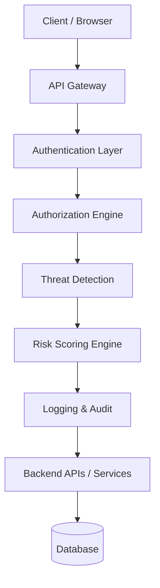
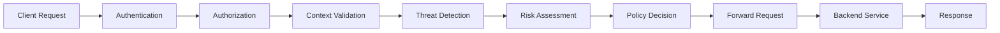

# Zero Trust Secure API Gateway with Attack Detection

<p align="center">
  
  
  
  
  
  
  
</p>

<p align="center">
  <strong>A production-style API gateway that enforces authentication, authorization, threat detection, rate limiting, and risk-based access control in one place.</strong>
</p>

---

## Executive Summary

This project implements a Zero Trust Secure API Gateway built with FastAPI that sits between clients and backend services. Instead of trusting incoming requests by default, the gateway evaluates identity, behavior, request patterns, and threat indicators before allowing traffic to proceed.

The system addresses common API security weaknesses such as weak authentication, missing authorization controls, brute-force abuse, injection attacks, and lack of centralized monitoring. It provides an end-to-end demonstration of core API security principles in a practical, academic and portfolio-friendly implementation.

---

## Problem Statement

Modern APIs are constantly exposed to:

- credential stuffing and brute-force login attempts
- SQL injection and XSS payloads
- token abuse and weak authentication flows
- inconsistent authorization checks
- flood or abuse traffic from bots and automated scanners
- limited visibility into who accessed what and when

Traditional gateways often focus on routing alone. This project fills the gap by introducing a policy-driven, risk-aware gateway that treats every request as untrusted until evidence supports otherwise.

---

## Project Objectives

- Build a secure API gateway with centralized request inspection
- Implement Zero Trust principles in an accessible real-world architecture
- Protect authentication and authorization flows using modern controls
- Detect and block common API attacks before they reach backend services
- Provide audit logs, dashboards, and risk visibility for security monitoring
- Create a strong portfolio-worthy project for cybersecurity, backend, and DevSecOps audiences

---

## Key Features

- Zero Trust request validation
- JWT-based authentication
- OAuth2 login with Google and GitHub
- MFA using TOTP via PyOTP
- Role-based access and authenticated user flows
- Reverse proxy support for upstream backend services
- In-memory sliding-window rate limiting
- WAF-style detection for SQL injection and XSS patterns
- Adaptive risk scoring middleware
- Audit logging and request event tracking
- Admin-style dashboard and protected routes
- SQLite-backed persistence with SQLAlchemy async support

---

## Technology Stack

| Layer | Technology |
|---|---|
| Backend | Python, FastAPI, Uvicorn |
| ORM / Database | SQLAlchemy, SQLite, aiosqlite |
| Authentication | JWT, PyJWT, python-jose |
| Security | Passlib, Argon2-style hashing, OAuth2, TOTP MFA |
| Frontend | HTML, CSS, JavaScript |
| HTTP Client | HTTPX |
| Deployment | NGINX, Docker-ready structure |
| Monitoring | Audit logs, request metrics, middleware headers |

---

## System Architecture



### Architecture Layers

- Client Layer: browsers, mobile clients, or testing tools send requests
- Gateway Layer: central decision point for every request
- Authentication Layer: validates JWTs and MFA status
- Authorization Layer: ensures authenticated users can access the intended resources
- Threat Detection Layer: inspects payloads and headers for malicious patterns
- Risk Engine: evaluates suspicious behavior and assigns a score
- Logging Layer: stores audit information for inspection and investigations
- Backend Layer: proxied services or application endpoints behind the gateway

---

## System Workflow



### Workflow Summary

1. A request enters the gateway.
2. Authentication is validated using JWT and session state.
3. Authorization rules are applied.
4. Request context is inspected for anomalies.
5. The WAF and risk engine evaluate suspicious behavior.
6. If the request passes, it is forwarded to the backend.
7. The response is logged and returned to the client.

---

## Project Architecture

The gateway is organized into modular components:

- gateway/main.py: app initialization and middleware registration
- gateway/routes/auth.py: registration, login, password reset, and token generation
- gateway/routes/oauth.py: Google and GitHub OAuth flows
- gateway/routes/mfa.py: TOTP-based MFA setup and verification
- gateway/routes/proxy.py: reverse proxy forwarding for upstream services
- gateway/routes/user.py: user profile, admin endpoints, and audit access
- gateway/middleware/waf.py: request payload and header inspection
- gateway/middleware/risk_scoring.py: adaptive risk scoring based on behavior and patterns
- gateway/middleware/rate_limit.py: request throttling and abuse prevention
- gateway/middleware/logging.py: centralized audit record generation
- gateway/db/models.py and gateway/db/schemas.py: persistence and validation layers

This separation makes the system easier to understand, test, and expand.

---

## Zero Trust Model

This project follows the core Zero Trust principles:

- Never trust: every request is evaluated independently
- Always verify: identity, token validity, and device/session context are checked
- Least privilege: protected routes require valid identity and authorization
- Continuous verification: suspicious patterns trigger monitoring and blocking
- Context awareness: request rate and headers influence risk evaluation
- Identity-driven access: authentication is a mandatory first gate

---

## Authentication

The authentication layer includes:

- Email/password registration and login
- JWT access token issuance and verification
- Token-based access protection for private routes
- MFA via time-based one-time passwords
- OAuth-based login for third-party identity providers

### Authentication Flow

1. User submits credentials.
2. Password is verified.
3. A JWT is issued for the authenticated session.
4. If MFA is enabled, the user completes a TOTP challenge.
5. The gateway authorizes subsequent requests using the token.

---

## Authorization

Authorization is enforced through role-aware and context-aware access patterns.

- Authenticated users can access personal account endpoints
- Admin-style operations are gated behind validated identity and protected routes
- Proxy routes require a valid token before upstream access is allowed
- The gateway ensures that security decisions are centralized rather than delegated blindly to backend services

---

## Attack Detection

The gateway implements several detection capabilities:

### SQL Injection Detection
- Scans request parameters and query strings for suspicious patterns
- Blocks payloads that resemble SQL tampering attempts

### Cross-Site Scripting Detection
- Inspects request data for script-like payloads and embedded HTML injection patterns
- Prevents unsafe content from flowing through the system

### Brute Force and Credential Abuse
- Rate limiting slows repeated login attempts
- Repeated abusive patterns raise suspicion in the risk engine

### Rate Limit Abuse
- Sliding-window request tracking limits burst traffic from an IP
- Excessive attempts trigger `429` responses and logging

### Suspicious Header and Bot Pattern Detection
- Unusual user-agent or request patterns increase risk scores
- Low-trust requests can be monitored or blocked depending on policy

### Mitigation Strategy
- Block confirmed malicious requests
- Challenge suspicious requests for additional verification
- Log all events for later review and response

---

## Risk Scoring Engine

The adaptive risk engine evaluates each request using a lightweight scoring model.

### Core Factors

- authentication strength and token validity
- request rate from a source IP
- suspicious headers or abnormal patterns
- presence of known attack indicators

### Behavior

- Low risk requests are allowed normally
- Medium risk requests are logged and monitored
- High risk requests can be challenged or blocked depending on policy

This creates a practical demonstration of how a gateway can move beyond static rules and respond to suspicious behavior dynamically.

---

## Logging & Monitoring

The system records security-relevant events for visibility and auditing.

- request-level logs
- authentication events
- blocked request events
- proxy activity
- risk-scoring decisions
- admin-oriented audit trail access

These logs help demonstrate how a gateway turns security into observable behavior rather than a silent backend concern.

---

## Dashboard

The frontend includes an admin-style experience designed to showcase gateway activity.

### Dashboard Pages

- Login page: authentication entry point
- Profile page: account and MFA management
- Admin dashboard: user/admin-facing monitoring experience

### What the dashboard highlights

- authentication state
- audit visibility
- account security features
- monitoring context for gateway activity

---

## API Endpoints

| Method | Endpoint | Purpose | Auth Required |
|---|---|---|---|
| POST | /auth/register | Create a new account | No |
| POST | /auth/login | Authenticate a user | No |
| POST | /auth/forgot-password | Request a password reset | No |
| POST | /auth/reset-password | Reset the password using a token | No |
| GET | /auth/me | View current user profile | Yes |
| PATCH | /auth/me | Update profile information | Yes |
| POST | /auth/mfa/setup | Begin MFA enrollment | Yes |
| POST | /auth/mfa/verify-setup | Complete MFA setup | Yes |
| POST | /auth/mfa/verify | Verify a TOTP code | Yes |
| GET | /health | Health check | No |
| GET | /api/v1/* | Reverse-proxy protected route | Yes |

---

## Folder Structure

```text
zero-trust-api-gateway/
├── frontend/                 # HTML/CSS/JS user experience
├── gateway/                  # Core API gateway application
│   ├── auth/                 # authentication helpers
│   ├── core/                 # security utilities and exceptions
│   ├── db/                   # database models, schemas, and setup
│   ├── middleware/           # WAF, risk, rate-limit, logging
│   ├── routes/               # auth, OAuth, MFA, proxy, user routes
│   └── main.py               # FastAPI app entry point
├── nginx/                    # reverse proxy deployment files
├── tests/                    # unit and integration tests
├── Requirements.txt          # Python dependencies
├── run.py                    # application runner
└── README.md                 # project documentation
```

---

## Installation Guide

### 1. Clone the repository

```bash
git clone https://github.com/your-username/zero-trust-api-gateway.git
cd zero-trust-api-gateway
```

### 2. Create a virtual environment

```bash
python -m venv venv
```

### 3. Activate the environment

Windows:

```bash
venv\Scripts\activate
```

Linux/macOS:

```bash
source venv/bin/activate
```

### 4. Install dependencies

```bash
pip install -r Requirements.txt
```

### 5. Run the application

```bash
python run.py
```

Or use:

```bash
uvicorn gateway.main:app --reload
```

---

## Configuration

The project uses environment variables and local configuration files for runtime behavior.

### Common configuration items

- SECRET_KEY for JWT signing
- DATABASE_URL for database location
- OAUTH client credentials for Google/GitHub
- proxy route settings for upstream services
- CORS origins and allowed hosts

You can adjust these in your environment or project configuration files before running the service.

---

## Usage Guide

1. Start the server.
2. Open the frontend pages from the project’s static files or local dev server.
3. Register an account or use OAuth login.
4. Explore protected routes and the gateway behavior.
5. Observe audit logs and blocked activity through the middleware flow.

---

## Screenshots

> Add screenshots in the repository to make the README visually stronger.

### Placeholder Gallery

- Landing Page
- Login / Registration Flow
- Dashboard Overview
- MFA Setup Screen
- Threat Detection / Blocked Request View
- Audit Logs and Monitoring View

---

## Security Features

| Feature | Description | Benefit |
|---|---|---|
| Zero Trust Enforcement | Requests are evaluated before trust is granted | Stronger API defense |
| JWT Validation | Authenticated requests require valid tokens | Prevents impersonation |
| MFA Support | TOTP protection for sensitive access | Reduces credential abuse |
| OAuth Integration | Third-party identity login support | Flexible authentication |
| WAF Patterns | Detects obvious payload-based attacks | Blocks common injection vectors |
| Rate Limiting | Prevents burst traffic and abuse | Preserves service availability |
| Risk Scoring | Suspicious behavior increases threat posture | Improves detection depth |
| Audit Logging | Security events are recorded | Simplifies investigation |

---

## Performance

The gateway is designed to be lightweight and practical for demonstration and development scenarios.

- Middleware-based inspection keeps logic centralized
- In-memory rate limiting reduces external dependencies
- Async request handling improves responsiveness
- The architecture is modular and suitable for future scaling and cloud deployment

---

## Technical Challenges

The project addresses several practical engineering challenges:

- enforcing security without breaking usability
- balancing inspection depth with request performance
- making authentication and authorization consistent across routes
- implementing transparent logging for security events
- designing a gateway that remains understandable for learning and evaluation purposes

---

## Testing

The repository includes test coverage and integration-oriented examples.

- unit tests for validation and security logic
- integration tests for auth flow behavior
- API-style testing scenarios for protected routes

---

## Learning Outcomes

This project demonstrates hands-on learning in:

- cybersecurity and API protection
- backend development with FastAPI
- authentication and session security
- middleware design and request inspection
- zero trust architecture patterns
- practical DevSecOps thinking and secure software design

---

## Future Enhancements

Potential upgrades for the next stage of the project:

- AI-assisted anomaly detection
- machine learning-driven behavior analytics
- SIEM integration and real-time alerting
- cloud-native deployment with Kubernetes
- broader WAF rule sets and policy engine expansion
- more advanced threat intelligence feeds

---

## Frequently Asked Questions

### What makes this project “Zero Trust”?
It does not assume trust based on location or prior access. Every request is validated and measured before it is accepted.

### Is this production-ready?
It is a strong academic and portfolio project with production-minded architecture patterns, but it should be hardened further for large-scale production deployment.

### Does it support OAuth?
Yes. The project includes Google and GitHub OAuth integration paths.

### Does it support MFA?
Yes. TOTP-based MFA is implemented for stronger authentication.

### What database does it use?
SQLite is used by default for local development and demonstration purposes.

---

## Interview Questions

### Cybersecurity
- What is Zero Trust and why is it important?
- How does a gateway reduce the attack surface of an API ecosystem?
- Why is centralized logging important in security systems?

### API Security
- What is the difference between authentication and authorization?
- Why are rate limits useful against abuse and scraping?
- How does a WAF help protect APIs?

### Backend Engineering
- Why use middleware in a web framework?
- How does async programming help API performance?
- What are the benefits of separating route logic from security logic?

---

## Resume Bullet Points

- Built a Zero Trust API gateway using FastAPI with authentication, MFA, OAuth2, rate limiting, and threat detection
- Implemented middleware-based WAF inspection and adaptive risk scoring for suspicious traffic
- Designed secure user flows with JWT handling, password reset, and audit logging
- Created a modular gateway architecture suitable for secure API routing and future expansion
- Demonstrated practical cybersecurity engineering through a portfolio-ready project

---

## LinkedIn Project Description

Built a Zero Trust Secure API Gateway using FastAPI to demonstrate modern API security concepts in practice. The project combines authentication, OAuth2, MFA, rate limiting, threat detection, audit logging, and reverse proxy capabilities in a modular architecture. It is designed to showcase secure backend engineering, cybersecurity awareness, and real-world API protection strategies.

---

## GitHub Repository Details

- Repository Name: zero-trust-api-gateway
- Description: A FastAPI-based Zero Trust API Gateway with authentication, MFA, OAuth2, rate limiting, WAF-style detection, risk scoring, and audit logging
- Topics: api-security, zero-trust, fastapi, cybersecurity, middleware, oauth, jwt

---

## Contributing

Contributions are welcome. If you would like to improve the gateway, add more detection rules, or expand the dashboard, please open an issue or submit a pull request.

---

## 🤝 Connect With Me

<div align="center">

| Platform | Link |
|----------|------|
| 🐙 **GitHub** | [github.com/Arshadali04](https://github.com/Arshadali04) |
| 💼 **LinkedIn** | [linkedin.com/in/arshadali4](https://linkedin.com/in/arshadali4) |
| 🌐 **Portfolio** | https://arshadali04-portfolio.netlify.app/ |
| 📧 **Email** | (arshadalia2703@gmail.com) |

<br/>

[](https://linkedin.com/in/arshadaliathani)
[](https://github.com/arshadaliathani)
[](#)
[](mailto:your.email@example.com)

</div>

---

## 👨‍💻 Author

**Arshadali Athani**  
**Role:** Computer Science Engineering Student  
**Interests:** Data Analytics, Data Engineer, Data Scientist

---

## Recruiter Highlights

This project demonstrates:

- secure software development practices
- API security engineering
- backend architecture and middleware design
- authentication and authorization implementation
- practical DevSecOps and monitoring thinking
- strong problem-solving and system design capability

---

## Final Technical Review

This README is positioned to appeal to recruiters, security engineers, software architects, and project evaluators by combining technical depth, practical implementation details, and strong documentation quality. If you want to make it even stronger, add real screenshots, deployment screenshots, and a short architecture diagram from your local environment.

