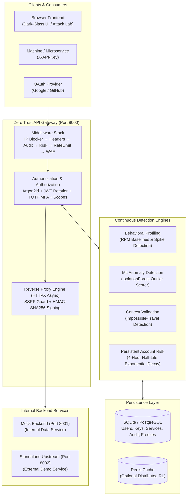
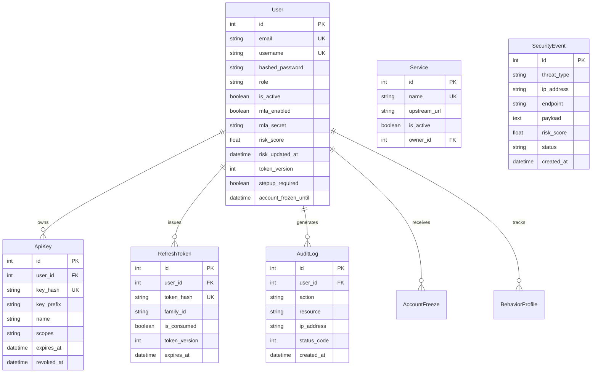

# Zero Trust Secure API Gateway

<p align="center">
  
  
  
  
  
  
  
  
  
  
</p>

<p align="center">
  <strong>An enterprise-grade, policy-driven API gateway that enforces authentication, least-privilege authorization, regex threat detection, sliding-window rate limiting, ML behavioral anomaly scoring, and dynamic adaptive enforcement at the network edge.</strong>
</p>

---

## Table of Contents

1. [Executive Summary & Abstract](#1-executive-summary--abstract)
2. [Problem Statement: Perimeter Defense vs. Zero Trust](#2-problem-statement-perimeter-defense-vs-zero-trust)
3. [Zero Trust Principles & Architecture](#3-zero-trust-principles--architecture)
4. [Request Lifecycle & Middleware Execution Pipeline](#4-request-lifecycle--middleware-execution-pipeline)
5. [Core Security Engines Deep Dive](#5-core-security-engines-deep-dive)
   - [5.1 Web Application Firewall (WAF)](#51-web-application-firewall-waf)
   - [5.2 Sliding-Window Rate Limiter](#52-sliding-window-rate-limiter)
   - [5.3 Adaptive Risk Scoring Engine](#53-adaptive-risk-scoring-engine)
   - [5.4 Machine Learning Anomaly Detection (IsolationForest)](#54-machine-learning-anomaly-detection-isolationforest)
   - [5.5 Behavioral Profiling & Baseline Learning](#55-behavioral-profiling--baseline-learning)
   - [5.6 Context Validation & Impossible-Travel Detection](#56-context-validation--impossible-travel-detection)
   - [5.7 Three-Tier Adaptive Enforcement (Monitor, Step-Up MFA, Freeze)](#57-three-tier-adaptive-enforcement)
   - [5.8 Outermost IP Blocker](#58-outermost-ip-blocker)
6. [Identity, Credentials & Key Governance](#6-identity-credentials--key-governance)
   - [6.1 Argon2id Password Hashing](#61-argon2id-password-hashing)
   - [6.2 JWT Access & Refresh Token Rotation with Reuse Detection](#62-jwt-access--refresh-token-rotation-with-reuse-detection)
   - [6.3 Multi-Factor Authentication (TOTP / RFC 6238)](#63-multi-factor-authentication-totp--rfc-6238)
   - [6.4 OAuth 2.0 Social Federation (Google & GitHub)](#64-oauth-20-social-federation-google--github)
   - [6.5 Scoped, Hashed Machine-to-Machine API Keys](#65-scoped-hashed-machine-to-machine-api-keys)
7. [Enterprise Reverse Proxy Engine & SSRF Protection](#7-enterprise-reverse-proxy-engine--ssrf-protection)
8. [Live Attack Lab & Real-Time Threat Visualization](#8-live-attack-lab--real-time-threat-visualization)
9. [Database Schema & Data Persistence](#9-database-schema--data-persistence)
10. [REST API Endpoint Catalog](#10-rest-api-endpoint-catalog)
11. [Technology Stack & Architectural Decisions](#11-technology-stack--architectural-decisions)
12. [Threat Model & Security Hardening](#12-threat-model--security-hardening)
13. [Comparison with Industry Gateways](#13-comparison-with-industry-gateways)
14. [Quickstart & Installation Guide](#14-quickstart--installation-guide)
15. [Testing & Quality Verification](#15-testing--quality-verification)

---

## 1. Executive Summary & Abstract

The **Zero Trust Secure API Gateway** is an asynchronous, high-throughput security gateway designed and built from first principles using Python 3 and FastAPI. Positioned as the single ingress point between external clients (browsers, mobile clients, partner microservices) and internal backend services, it enforces the foundational Zero Trust tenet: **"Never trust, always verify."**

Traditional network architectures rely on a "castle-and-moat" paradigm where anything inside the private network boundary is implicitly trusted. In modern cloud-native, multi-cloud, and remote-work realities, this model fails catastrophically: compromised credentials, vulnerable third-party dependencies, malicious insiders, and lateral network traversal allow attackers to compromise backends unabated.

This gateway replaces implicit perimeter trust with **continuous, multi-dimensional, per-request verification**. Every single inbound transaction is cryptographically authenticated, authorized against least-privilege scopes, inspected for malicious injection signatures, throttled via sliding-window rate counters, and evaluated by an adaptive multi-factor risk engine backed by unsupervised machine learning (**scikit-learn IsolationForest**). When suspicious behavior is detected, the gateway dynamically responds with graduated enforcement: from silent monitoring and header flags, to demanding step-up multi-factor authentication, up to IP-scoped account freezes and immediate JWT revocation.

---

## 2. Problem Statement: Perimeter Defense vs. Zero Trust

| Threat Vector | Traditional Perimeter Gateway | Zero Trust API Gateway (This Project) |
|---|---|---|
| **Compromised Credentials** | Attacker gains full access once valid credentials are provided. | **Continuous Risk Scoring & Behavioral Profiling**: Anomalous request volumes or unexpected client contexts elevate account risk and trigger step-up MFA or freeze. |
| **Lateral Movement** | Once past the edge firewall, internal microservices are open to unrestricted HTTP calls. | **Upstream HMAC Request Signing & Centralized Mediation**: Backends are never exposed directly. Upstreams verify cryptographic gateway signatures (`X-Gateway-Signature`). |
| **SQLi / XSS / Traversal** | Handled inconsistently across different backend application frameworks. | **Centralized Web Application Firewall**: Ingress inspection across paths, query strings, headers, and JSON bodies blocks injection attempts before backend reach. |
| **Credential Stuffing & DoS** | Naive fixed-window rate limits reset at interval boundaries, allowing bursts. | **Sliding-Window Rate Limiting & Brute-Force Guards**: Precise sliding windows enforce rolling caps per IP and path with exponential backoff (`Retry-After`). |
| **Token Theft & Replay** | Tokens remain valid until static expiry; stolen tokens allow silent impersonation. | **Family-Based Token Rotation & Token Versioning**: Refresh token reuse triggers family revocation; bumping `token_version` invalidates all outstanding access tokens instantly. |
| **SSRF Pivoting** | Dynamic proxy endpoints can be abused to probe internal clouds (e.g. AWS `169.254.169.254`). | **Strict Service SSRF Guard**: URL destination resolution validates upstream targets and rejects cloud metadata and unroutable addresses. |

---

## 3. Zero Trust Principles & Architecture


```mermaid
flowchart TD
    subgraph Clients["Clients & Consumers"]
        B["Browser Frontend<br/>(Dark-Glass UI / Attack Lab)"]
        M["Machine / Microservice<br/>(X-API-Key)"]
        O["OAuth Provider<br/>(Google / GitHub)"]
    end

    subgraph Gateway["Zero Trust API Gateway (Port 8000)"]
        direction TB
        MW["Middleware Stack<br/>IP Blocker → Headers → Audit → Risk → RateLimit → WAF"]
        AUTH["Authentication & Authorization<br/>Argon2id + JWT Rotation + TOTP MFA + Scopes"]
        PROXY["Reverse Proxy Engine (HTTPX Async)<br/>SSRF Guard + HMAC-SHA256 Signing"]
    end

    subgraph Engines["Continuous Detection Engines"]
        BE["Behavioral Profiling<br/>(RPM Baselines & Spike Detection)"]
        ML["ML Anomaly Detection<br/>(IsolationForest Outlier Scorer)"]
        GEO["Context Validation<br/>(Impossible-Travel Detection)"]
        AR["Persistent Account Risk<br/>(4-Hour Half-Life Exponential Decay)"]
    end

    subgraph Storage["Persistence Layer"]
        DB[("SQLite / PostgreSQL<br/>Users, Keys, Services, Audit, Freezes")]
        CACHE[("Redis Cache<br/>(Optional Distributed RL)")]
    end

    subgraph Upstream["Internal Backend Services"]
        DEMO["Mock Backend (Port 8001)<br/>(Internal Data Service)"]
        EXT["Standalone Upstream (Port 8002)<br/>(External Demo Service)"]
    end

    Clients --> MW
    MW --> AUTH
    AUTH <--> Engines
    Engines <--> Storage
    AUTH --> PROXY
    PROXY --> Upstream
```

### The 5 Architectural Pillars

1. **Verify Explicitly**: Authenticate identity and context on every request using all available data points (identity, geolocation, device risk, payload signatures).
2. **Use Least-Privilege Access**: Limit user and machine privileges with fine-grained scopes (`read`, `write`, `admin`, `proxy:<service>`).
3. **Assume Breach**: Minimize blast radius by verifying requests between every boundary, logging every event, and segmenting access.
4. **Continuous Adaptive Verification**: Evaluate risk dynamically throughout the user lifecycle rather than at authentication time alone.
5. **Separation of Control & Data Planes**: The gateway manages policy, governance, and audit trails while proxying sanitized traffic to upstreams.

---

## 4. Request Lifecycle & Middleware Execution Pipeline

Starlette and FastAPI execute middleware in onion order (the last middleware added via `add_middleware` is the outermost and executes first on ingress). The gateway registers middlewares in an engineered sequence:

```
[INBOUND REQUEST]
       │
       ▼
 1. IP Blocker Middleware (Outer Boundary: Drops blacklisted IPs immediately with 403)
       │
       ▼
 2. Security Headers Middleware (Nosniff, DENY, no-referrer, CSP, Cache-Control)
       │
       ▼
 3. Request Logging Middleware (Asynchronously records EVERY outcome to AuditLog)
       │
       ▼
 4. Adaptive Risk Scoring Middleware (Computes per-request score; populates X-Risk headers)
       │
       ▼
 5. Sliding-Window Rate Limiter (Enforces 10 req/min auth, 120 req/min default per IP)
       │
       ▼
 6. Web Application Firewall (WAF) (Regex & AST payload inspection for SQLi/XSS/Traversal)
       │
       ▼
 7. CORS Middleware (Origin whitelisting & credential policy)
       │
       ▼
 8. Session Middleware (OAuth CSRF state signing)
       │
       ▼
 9. Route Handlers & Dependencies (Identity verification, MFA step-up gate, freeze check)
       │
       ▼
10. Reverse Proxy Forwarder (HMAC request signing, header injection, async HTTP relay)
       │
       ▼
[UPSTREAM SERVICE RESPONSE]
```

### Why Risk Scoring Precedes Rate Limiting

A critical design innovation of this gateway is placing **Adaptive Risk Scoring outside Rate Limiting**. If the rate limiter ran first, automated attack floods would be dropped with HTTP 429 *before* the security engine could observe them. Consequently, behavioral counters would never accumulate, the ML model would never recognize the anomaly, and the gateway would fail to escalate the account's risk posture. By scoring first, every flood request feeds the behavioral engine and increments the risk score, successfully driving the account into step-up MFA or critical freeze before shedding load.

---

## 5. Core Security Engines Deep Dive

### 5.1 Web Application Firewall (WAF)

The WAF ([`gateway/middleware/waf.py`](file:///d:/zero-trust-api-gateway/gateway/middleware/waf.py)) inspects inbound requests for active attack payloads across:
- URL paths (unquoted and normalized)
- Query parameters
- Request headers (`User-Agent`, `Referer`, `X-Forwarded-For`, `Cookie`)
- JSON request bodies (recursively traversing keys and values)

#### Attack Detection Rules
- **SQL Injection (SQLi)**: Regex matching boolean tautologies (`' OR 1=1 --`), UNION SELECT attacks, stacked queries (`DROP TABLE`, `UPDATE users`), comment terminations (`--`, `/*`), and sleep/benchmark probes. Risk weight: `0.90`.
- **Cross-Site Scripting (XSS)**: Identification of `<script>` tags, inline event handlers (`onerror=`, `onload=`), `javascript:` URIs, and cookie extraction vectors (`document.cookie`). Risk weight: `0.80`.
- **Path Traversal**: Detection of dot-dot-slash patterns (`../`, `..\`), hex-encoded traversals (`%2e%2e%2f`, `%252e%252e%252f`), and sensitive system targets (`/etc/passwd`, `/etc/shadow`, `boot.ini`). Risk weight: `0.85`.
- **Command Injection**: Shell metacharacters (`|`, `;`, `&`, backticks) coupled with administrative binaries (`/bin/sh`, `cmd.exe`, `powershell`, `calc.exe`). Risk weight: `0.95`.

Blocked requests are halted with **HTTP 403 Forbidden**, append an `X-WAF-Blocked: 1` header, and write an immutable security event record to `SecurityEvent`. Static UI assets (`/frontend/*`), documentation (`/docs`), health probes (`/health`), and metrics (`/metrics`) are explicitly exempt.

### 5.2 Sliding-Window Rate Limiter

The rate limiter ([`gateway/middleware/rate_limit.py`](file:///d:/zero-trust-api-gateway/gateway/middleware/rate_limit.py)) tracks request timestamps within a continuous 60-second rolling sliding window per client IP:
- **Authentication Endpoints** (`/auth/login`, `/auth/register`): `10 req / 60s`
- **Password Recovery & MFA Setup** (`/auth/forgot-password`, `/auth/mfa/verify-setup`): `5 req / 60s`
- **Default Endpoints**: `120 req / 60s`

#### Dual-Backend Architecture
- **In-Memory Deque**: Uses thread-safe circular deques with monotonic clocks (`time.monotonic()`) and background memory eviction for single-instance zero-dependency setups.
- **Distributed Redis**: Uses Redis sorted sets (`ZADD`, `ZREMRANGEBYSCORE`, `ZCARD`) for horizontal multi-worker deployments.
- **Headers Returned**: `X-RateLimit-Limit`, `X-RateLimit-Remaining`, `X-RateLimit-Window`, and on exhaustion, HTTP 429 with `Retry-After`.

### 5.3 Adaptive Risk Scoring Engine

Every inbound request is assigned a deterministic, explainable risk score between `0.00` and `1.00`:

$$\text{Risk Score} = (R_{\text{auth}} \times 0.30) + (R_{\text{behavior}} \times 0.40) + (R_{\text{pattern}} \times 0.30)$$

- $R_{\text{auth}}$: Token validity, proximity to expiration, missing authentication, and path sensitivity.
- $R_{\text{behavior}}$: Rolling request frequency from the client IP and recent failed login spikes.
- $R_{\text{pattern}}$: Suspicious client headers, unusual HTTP verbs, non-browser user agents, and WAF anomaly indicators.

#### Action Thresholds
- **`0.00 - 0.39` (ALLOW)**: Normal traffic; forwarded transparently.
- **`0.40 - 0.64` (MONITOR)**: Mild deviation; passed upstream with audit annotation.
- **`0.65 - 0.79` (CHALLENGE)**: Elevated threat; requires step-up MFA re-verification.
- **`0.80 - 1.00` (BLOCK)**: Severe threat; rejected immediately with HTTP 403.

### 5.4 Machine Learning Anomaly Detection (IsolationForest)

Static rules alone fail against low-and-slow attacks and novel payload mutations. The gateway integrates an unsupervised **IsolationForest** model ([`gateway/detection/ml_anomaly.py`](file:///d:/zero-trust-api-gateway/gateway/detection/ml_anomaly.py)) from scikit-learn:
- **Feature Space**: 4-dimensional normalized vector: `[requests_per_minute, failed_auth_per_minute, log1p(body_bytes), hour_of_day]`.
- **Online Adaptation**: Maintains a per-user sliding window of recent traffic (up to 300 observations) and incrementally refits every 10 requests.
- **Outlier Scoring**: Requests where `decision_function()` falls below `-0.45` are flagged as anomalies and persisted as `ml_anomaly` events.
- **Graceful Fallback**: If scikit-learn is absent, the system seamlessly falls back to statistical baseline standard-deviation rules without crashing.

### 5.5 Behavioral Profiling & Baseline Learning

Tracks rolling behavioral baselines per user ([`gateway/detection/behavior.py`](file:///d:/zero-trust-api-gateway/gateway/detection/behavior.py)):
- Computes baseline requests per minute using exponential moving averages.
- Flags volume spikes exceeding $3\times$ the established baseline.
- Flags authentication spikes when $> 5$ failed attempts occur within 60 seconds.

### 5.6 Context Validation & Impossible-Travel Detection

During login, the gateway compares the client's current IP against their `last_login_ip` and timestamp ([`gateway/detection/context_validation.py`](file:///d:/zero-trust-api-gateway/gateway/detection/context_validation.py)):
- **GeoIP / Octet Distance Heuristic**: Measures network routing distance.
- If the velocity required to travel between the previous and current location exceeds plausible human flight speeds ($> 900\text{ km/h}$ within the elapsed time window), an `impossible_travel` event is raised, immediately elevating account risk.

### 5.7 Three-Tier Adaptive Enforcement

The gateway maintains a persistent, decaying account risk score (`User.risk_score`) stored in the database:

$$\text{Decayed Score} = \text{Peak Risk} \times 0.5^{\frac{\Delta t}{4\text{ hours}}}$$

1. **Tier 1 (Normal / Low Risk < 0.55)**: Full unrestricted access.
2. **Tier 2 (Step-Up MFA Required $\ge$ 0.55)**: Access to sensitive routes (`/api/v1/*`, `/admin/*`, `/api-keys/*`, `/services/*`) is denied with HTTP 403 (`X-Risk-Stepup: 1`) unless the user has completed TOTP verification *after* the risk elevation timestamp (`token.mfa_at > user.stepup_since`).
3. **Tier 3 (Critical Account Freeze $\ge$ 0.85)**:
   - **Immediate Session Revocation**: Increments `User.token_version`, instantly invalidating all outstanding JWT access and refresh tokens.
   - **IP-Scoped Lockout**: Freezes access from the attacking IP address for 1 hour (`X-Account-Frozen: 1`) without locking the user out from legitimate devices.

### 5.8 Outermost IP Blocker

Operating as the absolute first line of defense ([`gateway/middleware/ip_blocker.py`](file:///d:/zero-trust-api-gateway/gateway/middleware/ip_blocker.py)), the IP Blocker intercepts requests before WAF, rate limiting, or application code:
- Verifies the client IP against `BlockedIP` in memory and SQLite.
- **Auto-Block Trigger**: Any IP triggering 5 WAF hits within 120 seconds is automatically banned for 1 hour.
- **Loopback Protection**: Loopback addresses (`127.0.0.1`, `::1`, `localhost`) are permanently protected against auto-banning to prevent self-denial of service.

---

## 6. Identity, Credentials & Key Governance

### 6.1 Argon2id Password Hashing
Passwords are encrypted using Argon2id via `passlib`:
- Memory cost: 65,536 KiB (64 MiB)
- Time cost: 3 iterations
- Parallelism: 4 lanes
- Immune to GPU-accelerated dictionary attacks and eliminates the 72-byte truncation flaw inherent in bcrypt.

### 6.2 JWT Access & Refresh Token Rotation with Reuse Detection
- **Access Tokens**: Short-lived (30 minutes), carrying `sub`, `role`, `ver` (token version), `mfa_verified`, and `mfa_at`.
- **Refresh Token Rotation**: Each rotation issues a cryptographically secure single-use token tied to a `family_id`.
- **Reuse Detection**: If a previously consumed refresh token is presented (indicating token theft), the gateway invalidates the entire token family, requiring re-authentication.

### 6.3 Multi-Factor Authentication (TOTP / RFC 6238)
- Generates 32-character base32 secrets compatible with Google Authenticator, 1Password, and Apple Keychain.
- Renders scannable `otpauth://` QR codes via `qrcode[pil]`.
- Enforces strict 6-digit numeric validation within a 30-second time step.

### 6.4 OAuth 2.0 Social Federation (Google & GitHub)
- Implemented via `Authlib` with RFC 6749 compliance.
- Cryptographic CSRF state validation using `SessionMiddleware`.
- Automatic user provisioning and account linking.

### 6.5 Scoped, Hashed Machine-to-Machine API Keys
- Generated as high-entropy 32-byte strings prefixed with `ztg_live_`.
- Plaintext is revealed exactly once upon creation.
- Only the **SHA-256 hash** is persisted in the database; breaches leak zero working credentials.
- Bound to granular permission scopes (`read`, `write`, `admin`, `proxy:<service>`).
- Supports zero-downtime key rotation with grace periods and immediate revocation.

---

## 7. Enterprise Reverse Proxy Engine & SSRF Protection

The reverse proxy router ([`gateway/routes/proxy.py`](file:///d:/zero-trust-api-gateway/gateway/routes/proxy.py)) forwards authenticated client requests to internal upstream microservices:

```
Client  ──[GET /api/v1/data/users]──►  Gateway  ──[GET /users + HMAC]──►  Upstream (Port 8001)
```

1. **Route Resolution**: Matches the service identifier (`/api/v1/{service}/{path}`) against the dynamic `Service` table or static routes.
2. **SSRF Guard**: Before forwarding, the target hostname is resolved via DNS. If the resolved IP targets cloud metadata services (`169.254.169.254`) or loopback when disabled, the request is rejected with HTTP 400.
3. **Cryptographic Identity Injection**: The gateway injects identity context and signs the outbound request using HMAC-SHA256:
   - `X-Gateway-User`: Authenticated user email / API key ID.
   - `X-Gateway-Role`: User role (`user`, `admin`, `service`).
   - `X-Request-ID`: Distributed tracing UUID.
   - `X-Forwarded-For`: Original client IP.
   - `X-Gateway-Timestamp`: Current UTC epoch timestamp.
   - `X-Gateway-Signature`: `HMAC-SHA256(secret, timestamp + method + path)`.
4. **Streaming Response**: Uses `httpx.AsyncClient` with connection pooling to stream upstream responses directly to the client without buffering entire payloads in memory.

---

## 8. Live Attack Lab & Real-Time Threat Visualization

The gateway includes an integrated, interactive browser-based Attack Lab (`frontend/attack-lab.html`):

- **Real Attack Traffic Generation**: Generates genuine HTTP requests against the gateway's own ingress endpoints:
  - `sqli`: SQL injection payloads in bodies and headers (`SELECT * FROM users; DROP TABLE...`)
  - `xss`: Cross-site scripting tags (`<script>alert(document.cookie)</script>`)
  - `path_traversal`: Traversal queries (`/api/v1/data/../../etc/passwd`)
  - `bruteforce`: Rapid failed authentication attempts against `/auth/login`
  - `flood`: High-frequency authenticated requests to evaluate behavior and ML anomaly engines
- **Live Duplex WebSocket Feed** (`/ws/attack-lab`): Streams real-time state snapshots every 300ms, updating:
  - Request counters (total, blocked, allowed, block rate %)
  - Real-time risk sparklines
  - Live security event timeline
  - Interactive WebGL 3D threat topology

---

## 9. Database Schema & Data Persistence

Managed via SQLAlchemy 2.0 async declarative models (`gateway/db/models.py`) with automatic schema migration:


```mermaid
erDiagram
    User ||--o{ ApiKey : owns
    User ||--o{ RefreshToken : issues
    User ||--o{ AuditLog : generates
    User ||--o{ AccountFreeze : receives
    User ||--o{ BehaviorProfile : tracks

    User {
        int id PK
        string email UK
        string username UK
        string hashed_password
        string role
        boolean is_active
        boolean mfa_enabled
        string mfa_secret
        float risk_score
        datetime risk_updated_at
        int token_version
        boolean stepup_required
        datetime account_frozen_until
    }

    ApiKey {
        int id PK
        int user_id FK
        string key_hash UK
        string key_prefix
        string name
        string scopes
        datetime expires_at
        datetime revoked_at
    }

    RefreshToken {
        int id PK
        int user_id FK
        string token_hash UK
        string family_id
        boolean is_consumed
        int token_version
        datetime expires_at
    }

    Service {
        int id PK
        string name UK
        string upstream_url
        boolean is_active
        int owner_id FK
    }

    SecurityEvent {
        int id PK
        string threat_type
        string ip_address
        string endpoint
        text payload
        float risk_score
        string status
        datetime created_at
    }

    AuditLog {
        int id PK
        int user_id FK
        string action
        string resource
        string ip_address
        int status_code
        datetime created_at
    }
```

---

## 10. REST API Endpoint Catalog

| Method | Endpoint | Access Level | Description |
|---|---|---|---|
| `GET` | `/health` | Public | Liveness probe returning status and database connectivity |
| `GET` | `/ready` | Public | Readiness probe for container orchestration |
| `GET` | `/metrics` | Public | Prometheus observability metrics scrape endpoint |
| `POST` | `/auth/register` | Public | Register new user account with Argon2id password validation |
| `POST` | `/auth/login` | Public | Authenticate user; returns access token, refresh token, MFA status |
| `POST` | `/auth/refresh` | Public | Rotate refresh token family; returns new token pair |
| `POST` | `/auth/logout` | Authenticated | Revoke refresh token family and terminate session |
| `GET` | `/auth/me` | Authenticated | Get current user profile, decayed risk score, and step-up status |
| `PATCH` | `/auth/me/password` | Authenticated | Change password; bumps token version and invalidates older sessions |
| `POST` | `/auth/mfa/setup` | Authenticated | Generate TOTP secret and QR code URI |
| `POST` | `/auth/mfa/verify-setup` | Authenticated | Verify first TOTP code and enable MFA on account |
| `POST` | `/auth/mfa/verify` | Authenticated | Verify TOTP code during login or step-up challenge |
| `POST` | `/auth/mfa/disable` | Authenticated | Disable MFA (requires valid TOTP code) |
| `GET` | `/api-keys` | Authenticated | List all scoped API keys created by caller |
| `POST` | `/api-keys` | Authenticated | Create new scoped API key; returns plaintext key once |
| `DELETE`| `/api-keys/{id}` | Authenticated | Revoke API key immediately |
| `POST` | `/api-keys/{id}/rotate` | Authenticated | Rotate API key with optional grace period |
| `ALL` | `/api/v1/{service}/{path}`| Auth / API Key | Reverse proxy traffic to registered upstream with HMAC signing |
| `GET` | `/admin/users` | Admin Only | List all registered users, risk scores, and account statuses |
| `POST` | `/admin/users/{id}/freeze` | Admin Only | Manually freeze user account |
| `POST` | `/admin/users/{id}/unfreeze`| Admin Only | Manually unfreeze user account |
| `PATCH` | `/admin/users/{id}/role` | Admin Only | Change user role (`user` $\leftrightarrow$ `admin`) |
| `GET` | `/admin/security-events`| Admin Only | Query security threat log with filtering by threat type |
| `GET` | `/admin/audit-logs` | Admin Only | Query complete audit history with pagination |
| `POST` | `/admin/block-ip` | Admin Only | Add IP address to global blocklist |
| `DELETE`| `/admin/block-ip/{ip}` | Admin Only | Remove IP address from global blocklist |
| `POST` | `/attack-lab/run` | Authenticated | Launch simulated attack against gateway |
| `POST` | `/attack-lab/stop` | Authenticated | Halt active attack simulation |
| `GET` | `/attack-lab/state` | Authenticated | Polling endpoint for Attack Lab state |
| `WS` | `/ws/attack-lab` | Authenticated | Duplex WebSocket stream of real-time Attack Lab telemetry |

---

## 11. Technology Stack & Architectural Decisions

| Layer | Component | Choice | Engineering Justification |
|---|---|---|---|
| **Runtime & Web** | Framework | **FastAPI (Python 3.11+)** | Native async/await concurrency for I/O-bound proxying; automatic OpenAPI schema validation; type-safe dependency injection. |
| **Server** | ASGI Server | **Uvicorn + websockets** | Lightweight, high-performance ASGI server supporting both HTTP/1.1 streaming and full duplex WebSockets. |
| **Database** | ORM & Engine | **SQLAlchemy 2.0 + aiosqlite** | Clean async relational ORM; portable zero-configuration SQLite for development; easily swappable with PostgreSQL in production. |
| **Authentication** | Cryptography | **Argon2id + PyJWT** | Memory-hard password hashing immune to GPU rigs; RFC 7519 JWTs with custom token-version revocation. |
| **MFA** | TOTP | **PyOTP + qrcode[pil]** | RFC 6238 compliant; no external SMS/push provider needed; compatible with standard mobile authenticators. |
| **Machine Learning** | Anomaly Detection | **scikit-learn IsolationForest** | Unsupervised outlier detection requiring no labeled training data; fast in-memory per-user sliding window refitting. |
| **HTTP Client** | Proxy Forwarder | **HTTPX Async** | Non-blocking HTTP client supporting streaming responses, connection pooling, and granular timeouts. |
| **Frontend UI** | Client Dashboard | **Vanilla HTML5, CSS3 & JS (ESM)** | Zero-build simplicity, instant execution without Node.js tooling, dark-glass aesthetic with hardware-accelerated WebGL background. |
| **DevOps** | Containerization | **Docker & Docker Compose** | Multi-stage, non-root secure container packaging with integrated healthchecks and volume persistence. |

---

## 12. Threat Model & Security Hardening

### Addressed Threat Vectors
- **Broken Object Level Authorization (BOLA)**: Scoped API keys and database-level ownership verification.
- **Broken Authentication**: Argon2id hashing, brute-force throttling, JWT versioning, and family-based refresh rotation.
- **Injection Flaws**: Centralized regex WAF across query strings, headers, and request bodies.
- **Unrestricted Resource Consumption**: Sliding-window rate limiting per IP and path with exponential backoffs.
- **SSRF**: Upstream DNS resolution guard blocking loopback and cloud metadata ranges (`169.254.169.254`).
- **Session Hijacking**: Short-lived tokens, impossible-travel velocity checks, and immediate token-version revocation on password reset.

### Security Headers Enforced
```http
X-Content-Type-Options: nosniff
X-Frame-Options: DENY
Referrer-Policy: no-referrer
X-XSS-Protection: 0
Permissions-Policy: geolocation=(), microphone=(), camera=()
Content-Security-Policy: default-src 'self'; script-src 'self' 'unsafe-inline' https://cdnjs.cloudflare.com https://cdn.jsdelivr.net; style-src 'self' 'unsafe-inline' https://fonts.googleapis.com; font-src 'self' https://fonts.gstatic.com; img-src 'self' data:; connect-src 'self' ws://127.0.0.1:8000 ws://localhost:8000; base-uri 'self'; form-action 'self'; frame-ancestors 'none'
```

---

## 13. Comparison with Industry Gateways

| Feature | This Project | Kong Gateway (OSS) | AWS API Gateway | Cloudflare |
|---|---|---|---|---|
| **Continuous Risk Scoring** | Built-in explainable formula | Enterprise Plugin ($$$) | Custom Lambda required | Cloudflare Bot Management ($$$) |
| **Step-Up MFA** | Dynamic, risk-triggered | ❌ | ❌ | Access policies |
| **Real-Time Attack Lab** | Built-in duplex WebSocket | ❌ | ❌ | ❌ |
| **ML Behavioral Outliers** | Per-user IsolationForest | Enterprise Plugin ($$$) | CloudWatch Anomaly ($$$) | Proprietary ML models |
| **Stateless Revocation** | Database token versioning | Redis Denylist | Cognito Revocation | Revocation API |
| **Zero-Config Deployment** | One Python command | Complex setup | Cloud account required | Cloud routing required |
| **Infrastructure Cost** | Free & Open Source | Free tier / Enterprise | Pay per request | Subscription based |

---

## 14. Quickstart & Installation Guide

### Prerequisites
- Python 3.10, 3.11, 3.12, or 3.14
- Git

### 1. Clone & Set Up Environment
```bash
git clone https://github.com/Arshadali04/zero-trust-secure-api-gateway.git
cd zero-trust-api-gateway

# Create and activate virtual environment
python -m venv .venv

# On Linux / macOS:
source .venv/bin/activate

# On Windows (PowerShell):
.\.venv\Scripts\Activate.ps1
```

### 2. Install Dependencies
```bash
pip install -r requirements.txt
pip install -r requirements-dev.txt
```

### 3. Launch the Gateway
```bash
python run.py
```
The gateway server starts at **`http://127.0.0.1:8000`** and automatically launches the mock backend service on port `8001`.

### 4. (Optional) Launch the Standalone Upstream Demo Service
To demonstrate custom reverse proxy routing and HMAC header inspection on port `8002`:
```bash
python demo_service.py
```

### 5. Access the Web Application
Open your browser and navigate to:
- **Web UI & Dashboard**: [http://127.0.0.1:8000/frontend/login.html](http://127.0.0.1:8000/frontend/login.html)
- **Interactive OpenAPI Documentation**: [http://127.0.0.1:8000/docs](http://127.0.0.1:8000/docs)
- **Prometheus Metrics**: [http://127.0.0.1:8000/metrics](http://127.0.0.1:8000/metrics)

---

## 15. Testing & Quality Verification

The gateway is backed by a rigorous automated test suite covering unit, integration, and end-to-end flows.

### Run All Tests with Coverage Gate
```bash
pytest tests/ -v --cov=gateway --cov-fail-under=59.4
```
*Current test suite results:* **137 passed**, 5 skipped, **63.38% code coverage** (exceeds the 59.4% quality gate).

### Code Style & Linting
```bash
# Lint checks
flake8 gateway/ tests/ --max-line-length=120 --ignore=E501,W503,E203 --count

# Import order check
isort --check-only --diff gateway/ tests/
```

### Security Scanning
```bash
bandit -r gateway/ -ll -ii --exclude gateway/demo/
```

---

<p align="center">
  <sub>Zero Trust Secure API Gateway — Engineered for defense-in-depth, zero implicit trust, and continuous verification.</sub>
</p>
